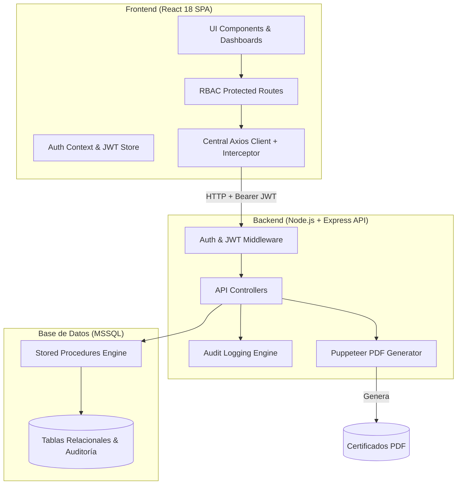
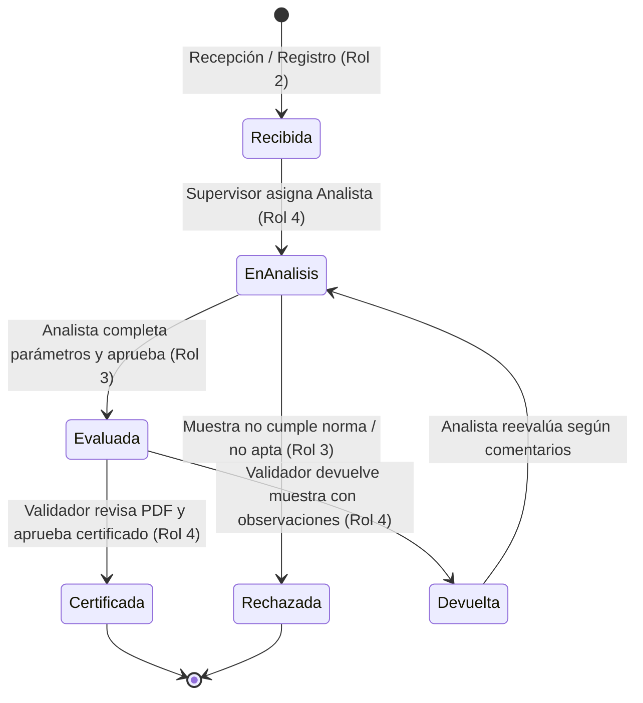

# 🧪 LIMS - Sistema de Gestión de Laboratorio de Control de Calidad

[](https://react.dev/)
[](https://nodejs.org/)
[-cc292b?logo=microsoft-sql-server&logoColor=white)](https://www.microsoft.com/sql-server/)
[](https://jwt.io/)
[](https://pptr.dev/)

Sistema integral tipo **LIMS (Laboratory Information Management System)** para la gestión, trazabilidad, análisis y certificación de calidad de muestras de agua potable, alimentos y bebidas según normativas técnicas (**NORDOM**).

Diseñado con una arquitectura desacoplada Full-Stack orientada a la seguridad, control de accesos basado en roles (RBAC), transaccionalidad mediante procedimientos almacenados en SQL Server y generación automatizada de certificados de calidad en PDF.

---

## 🏛️ Arquitectura del Sistema



---

## 🔄 Ciclo de Vida de una Muestra



---

## 👥 Matriz de Roles y Accesos (RBAC)

| IdRol | Rol | Módulos y Permisos |
| :---: | :--- | :--- |
| **1** | **Administrador** | Acceso global: gestión de usuarios, activación/desactivación, auditoría de eventos y supervisión general. |
| **2** | **Registro / Recepción** | Recepción de muestras, generación de código secuencial por tipo (`AGU-`, `ALI-`, `ALC-`) y alta de solicitantes. |
| **3** | **Analista de Laboratorio** | Vista de muestras asignadas, ingreso de mediciones físico-químicas/microbiológicas, validación automática de rangos de norma y envío de resultados. |
| **4** | **Validador / Supervisor** | Asignación de muestras a analistas, revisión técnica de certificados PDF generados, aprobación final o devolución con comentarios. |
| **5** | **Cliente** | Consulta del estado y descarga de certificados de sus muestras. |

---

## 🚀 Características Técnicas Destacadas

- **Seguridad y JWT:** Autenticación con contraseñas cifradas en `bcrypt` (10 rounds de salt) y tokens `JWT` enviados vía encabezados HTTP `Bearer`.
- **Rutas Protegidas en Frontend:** Componente `<ProtectedRoute allowedRoles={[...]}>` que verifica la validez del token y el rol de usuario antes de renderizar cada vista.
- **Interceptors Centralizados:** Cliente `api.js` de Axios configurado con inyección automática de token y redirección a login ante expiración (`401`).
- **Base de Datos Robusta:** Toda la lógica de negocio, consultas complejas, generación de folios e inserciones se gestiona a través de **Procedimientos Almacenados (Stored Procedures)** en SQL Server con transacciones (`sql.Transaction`).
- **QA/QC Automático:** Evaluación en tiempo real de límites permisibles (`ValorMin` y `ValorMax`) en el formulario de análisis con marcado inteligente del cumplimiento de norma.
- **Generación de Reportes PDF:** Integración con Puppeteer para compilar certificados con formato oficial A4, datos del solicitante, tabla de resultados y código único de muestra.
- **Auditoría:** Registro automático de eventos clave (creación de usuarios, cambios de estado, envío de análisis, asignaciones).

---

## 🛠️ Instalación y Puesta en Marcha

### Prerrequisitos
- **Node.js** (v18 o superior)
- **npm** (v9 o superior)
- **Microsoft SQL Server** (2019 / 2022 o Express)

---

### 1. Clonar el Repositorio
```bash
git clone https://github.com/tu-usuario/laboratorio-app.git
cd laboratorio-app
```

---

### 2. Configurar la Base de Datos
1. Abre SQL Server Management Studio (SSMS) o Azure Data Studio.
2. Ejecuta el script completo [schema.sql](schema.sql) para crear la base de datos `LaboratorioControlCalidad`, tablas, procedimientos almacenados y datos iniciales de tipos de muestra y normas.

---

### 3. Configurar y Ejecutar el Backend
```bash
cd backend
npm install
```

Copia la plantilla de variables de entorno y ajusta las credenciales de tu SQL Server:
```bash
cp .env.example .env
```

Contenido de `backend/.env`:
```env
PORT=3001
DB_USER=sa
DB_PASSWORD=TuPassword123
DB_SERVER=127.0.0.1
DB_PORT=1433
DB_DATABASE=LaboratorioControlCalidad
JWT_SECRET=super_secreto_laboratorio_lims_jwt_key_2025_prod
JWT_EXPIRES_IN=24h
```

Inicia el backend en modo desarrollo:
```bash
npm start
```
> El servidor iniciará en `http://localhost:3001`.

---

### 4. Configurar y Ejecutar el Frontend
En otra terminal:
```bash
cd frontend
npm install
```

Copia la plantilla de variables de entorno:
```bash
cp .env.example .env
```

Contenido de `frontend/.env`:
```env
REACT_APP_API_URL=http://localhost:3001/api
```

Inicia el cliente React:
```bash
npm start
```
> La aplicación se abrirá en `http://localhost:3000`.

---

## 🔑 Credenciales de Prueba

Para demostración rápida o pruebas de evaluación, puedes utilizar las siguientes cuentas preconfiguradas:

| Rol | Correo Electrónico | Contraseña |
| :--- | :--- | :--- |
| **Administrador** | `admin@laboratorio.com` | `Admin123!` |
| **Supervisor / Validador** | `validador@laboratorio.com` | `Validador123!` |
| **Analista Químico** | `analista@laboratorio.com` | `Analista123!` |
| **Recepción / Registro** | `registro@lab.com` | *(creado en schema inicial)* |

---

## 📁 Estructura del Proyecto

```text
laboratorio-app/
├── backend/
│   ├── config/           # Conexión y pool a MSSQL (dotenv)
│   ├── controllers/      # Controladores de negocio (muestras, analista, validador, auth)
│   ├── middleware/       # Verificación de JWT y roles
│   ├── routes/           # Definición de endpoints REST
│   ├── certificados/     # Carpeta de almacenamiento de certificados PDF generados
│   ├── utils/            # Módulo de auditoría y utilitarios
│   ├── server.js         # Entrada del servidor Express
│   └── package.json
├── frontend/
│   ├── src/
│   │   ├── components/   # Dashboards y formularios por rol (Admin, Analista, Validador, Recepción)
│   │   ├── context/      # AuthContext con almacenamiento seguro en localStorage
│   │   ├── services/     # Cliente centralizado Axios con interceptores
│   │   ├── assets/       # Estilos CSS específicos por módulo
│   │   └── App.js        # Enrutador principal y configuración RBAC
│   └── package.json
├── schema.sql            # Script DDL/DML completo para SQL Server
├── .gitignore            # Exclusión de .env, node_modules y PDFs temporales
└── README.md             # Documentación técnica
```

---

## 📄 Licencia
Este proyecto fue desarrollado con fines demostrativos, académicos y profesionales para gestión y control de calidad en laboratorios.
